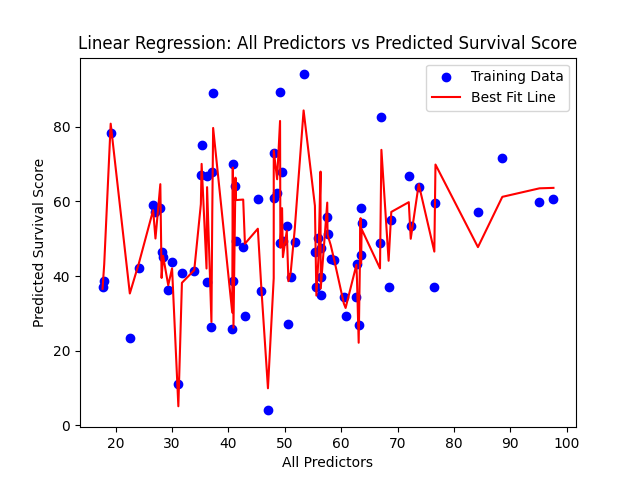
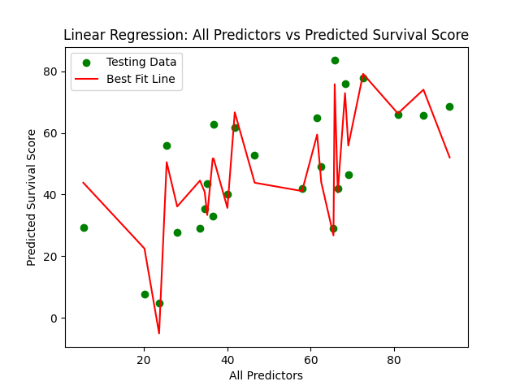

# Survival Score Prediction Briefing

## 1. Introduction
Brief overview of the project:
- Objective: Determine if the scores assigned by the survival specialists are accurate or not.
- Data Sources:
    - CSV with each previous contestants' estimated scores and their actual survival scores.
    - CSV with the upcoming participants and their approximated scores.

## 2. Expert Scoring Evaluation

### 2.1 Statistical Analysis of Past Scores
- Summary statistics of past survival scores.
    - **R-squared: 0.820**
        - Approximately 82% of the traits estimated by the survival specialists explain the survival score.
        - This indicates a strong linear relationship between all of the relevant predictors and the actual survival score.
            - Thus, the experts' scoring system contains substantial predictive signal. 
    - **P-values: Three predictors below 0.001 (x2, x7, and x9).**
        - This demonstrates that these three specific features are statistically significant, with p-values of 0.000.
        - As such, these traits contribute meaningfully to predicting survival scores, while other scores may have weaker or inconsistent effects. 
    - **Coefficients vary widely.**
        - Strong positive influence: Traits x6, x8, and x7 show substantial impact.
        - Moderate to minimal positive influence: Traits x2, x3, and x4 contribute positively, but with a less pronounced effect.
        - Negative influence: Traits x5, x9, and x1 reduce survival scores, ranging from mild to strong. 
            - Overall, most of the coefficients contribute positively to the survival scores, with three pulling the scores downward. 
    - **Standard errors are consistent and relatively low.**
        - This suggests stable and precise estimates, especially for the significant predictors. 

        | Variables | Traits          | P-values | Coefficients | Std Err |
        |-----------|-----------------|----------|--------------|---------|
        | x1        | Leadership      | 0.115    | -0.6528      | 0.410   |
        | x2        | MentalToughness | 0.000    |  0.4611      | 0.047   |
        | x3        | SurvivalSkills  | 0.465    |  0.3275      | 0.447   |
        | x4        | RiskTaking      | 0.913    |  0.0484      | 0.444   |
        | x5        | Resourcefulness | 0.528    | -0.2681      | 0.423   |
        | x6        | Adaptability    | 0.092    |  0.7142      | 0.419   |
        | x7        | PhysicalFitness | 0.000    |  0.5012      | 0.046   |
        | x8        | Teamwork        | 0.099    |  0.6760      | 0.405   |
        | x9        | Stubborness     | 0.000    | -0.5329      | 0.049   |

- Z-score distribution analysis.
    - This distribution illustrates how the traits vary across participants, however it does not unveil strong predictive patterns.

    

- Trait correlations with survival score using heat map and Pearson's R.
    - This heat map only highlights correlative values above 0.3, meaning any values below 0.3 are irrelevant.
    - With the exception of teamwork and leadership, most features demonstrate at least moderate correlation (Pearson's R > 0.3) with survival scores.
        - This suggests that there is some predictive relevance between the traits and the survival scores.
    - Notably, three trait pairs exhibit perfect correlation (+/- 1), indicating extreme linear dependence.
        - These matches, thus, could either be conceptually overlapped or scored redundantly. 
        - This poses an issue for performing linear regression, as variables with high correlation can result in the model overfitting or unstable coefficient estimates.

    

### 2.2 Linear Regression Performance on Training and Testing Data
- RMSE and r-squared values for multiple linear regression model, split into training and testing data.
- Based on the linearity check, the model was trained on a reduced number of predictors. 
    - Specifically, traits with extremely low or extremely high Pearson correlation to the survival score were excluded to enhance the model's stability and to reduce overfitting.
    - Training Set Performance
        - **RMSE: 7.3465**
        - **R-Squared: 0.8167**
            - On average, the model's predictions deviate from actual survival scores by 7.35 points.
            - An r-squared of 0.8167 indicates that the model explains 82% of the variance in the training data.
                - This suggests that the model has meaningful predictive power.

    

    - Testing Set Performance
        - **RMSE: 9.3071**
        - **R-Squared: 0.7896**
            - The prediction error slightly increased on the testing data, with an average deviation of 9.31 points.
            - The r-squared value dropped modestly, but it remains relatively high.
                - This points to the model having a good ability to generalize the scores well.
                - Additionally, the scores given by the experts retain their predictive relevance.

    

### 2.3 Interpretation of Past Scores
- The survival experts, overall, scored the previous contestants consistently, with strong predictive alignment for key features.
- The initial statistical analysis revealed strong alignment between estimated traits and actual survival outcomes.
    - With an r-squared of 0.82 and significant predictors (x2, x7, and x9), the expert scores show robust predictive capability. 
    - However, several features remain statistically weak, suggesting that while the scoring system is effective overall, not all traits contribute equally. 
- Nevertheless, the regression model showed strong performance after reducing the predictor set, based on the linearity check.
    - The training and testing r-squared values (0.8167 and 0.7896) indicate that the refined trait subset captures meaningful variance in the survival scores.
    - Moreover, while the full set of expert scores were noisy, the filtered subset retained its predictive relevance.
- The Conceptually overlapping or opposing traits (e.g., “RiskTaking” and “SurvivalSkills”) may have reflected scoring bias or redundancy.
    - These relationships could have diluted the model’s accuracy prior to feature selection.
- Altogether, the experts' scoring system contains signal, but could be prone to overfitting and instability without careful feature selection.

## 3. Predictive Modeling

### 3.1 Model Setup
- Trained a multiple linear regression model on past survivors.
- Predictors: Expert-assigned trait scores (SurvivalSkills, PhysicalFitness, Stubbornness, Adaptability, MentalToughness)
- Target: Actual survival score.

### 3.2 Prediction Results Using Reduced Predictors
- Predicted survival scores for new contestants.
    - Table: Top 3 participants and their corresponding predicted survival scores.

        | Name       | Predicted Survival Score |
        |------------|--------------------------|
        | Nico       | 82.37                    |
        | Byron      | 70.67                    |
        | Jonah      | 61.25                    |

- Previous and predicted score distribution, include mean alignment.
    - Visual: Histogram overlay with two vertical dashed lines marking the mean survival scores.
    - **Past Mean: 49.57**
    - **Predicted Mean: 49.14**
        - As the two means are very close, the model likely represents the central tendency of the survival scores reasonably well.
        - The distribution shape has concrete signs of compression toward the mean, a possible result of a lack of strong data.
            - Main sign includes: The predicted scores are less frequent at the extreme compared to the past scores.
        - The model is likely less sensitive to individual differences, since the predicted scores cluster more tightly than the past scores.
            - This could be linked to the expert scores having additional trait redundancy.

    

### 3.3 Interpretation
- The survival experts captured the average survival profile but missed individual nuance, as shown by compressed prediction spread.
- The experts' scoring system reflected a stable but shallow predictive framework.
    - This makes it adequate for estimating average performance, but insufficient for capturing individual nuance. 

## 4. Conclusion
- In summary, the survival experts' trait scoring shows strong alignment with actual survival outcomes.
    - The experts' ratings were consistent and statistically predictive, especially for key traits.
    - Nevertheless, some traits lacked significance, indicating room for refinement in the scoring framework. 
- The distribution of predicted scores, additionally, was compressed, suggesting that the experts' ratings were too conservative and lacked sensitivity of the contestants' behaviors. 
- Overall, the expert scoring framework contains **latent predictive value**, but its cautious structure and trait redundancy limited its effectiveness.
    - Without refinement, the system risks underrepresenting behavioral nuance and misaligning with real-world performance. 

## 5. Recommendation
- Reduce Trait Redundancy
    - To improve the validity of future survival scoring frameworks, survival experts should:
        - Ensure they keep variables independent of each other by avoiding scoring traits that are conceptually or statistically redundant. 
            - This will reduce multicollinearity and deepen the interpretability of predictive models.
- Expand the Scoring Range
    - Include a broader scoring range where they can be more liberal about assigning greater point values to participants' traits, where relevant.
        - This will help differentiate contestants who are likely to perform higher.
- Together, these adjustments will aid in enhancing the predictability of the model while identifying the individual strengths of participants more accurately. 