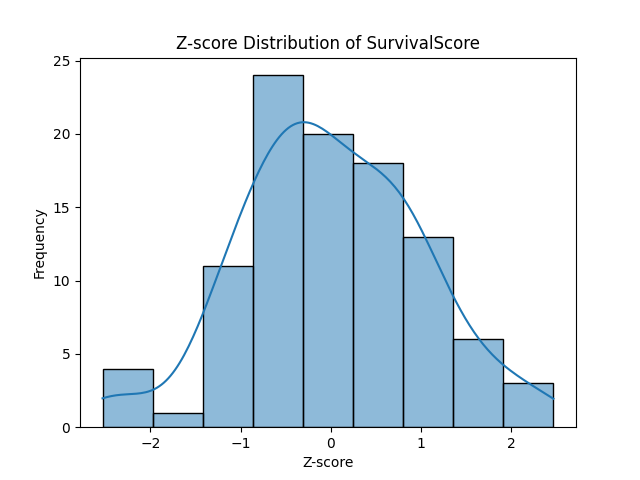
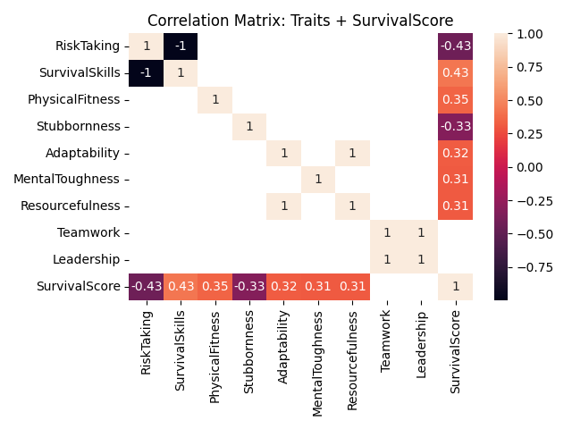
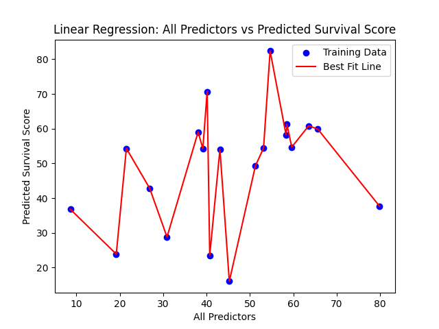
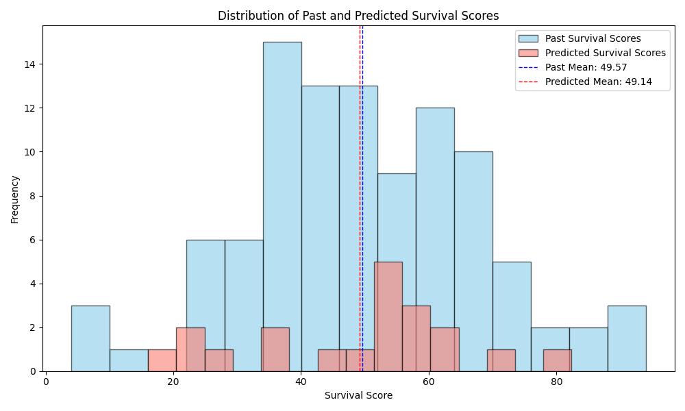

# Survival Score Prediction Briefing

## 1. Introduction
Brief overview of the project:
- Objective: Determine if the scores assigned by the survival specialists are accurate or not.
- Data Sources:
    - CSV with each previous contestants' estimated scores and their actual survival scores.
    - CSV with the upcoming participants and their approximated scores.

## 2. Expert Scoring Evaluation

### 2.1 Statistical Analysis of Past Scores
- Summary statistics of past survival scores.
    - **R-squared: 0.090**
        - Only 9% of the traits estimated by the survival specialists explain the survival score.
        - This suggests that the raw approximations are not strong enough to predict real outcomes.
    - **P-values: None below 0.05.**
        - This demonstrates that none of the predictors are statistically significant.
        - Moreover, each trait's influence may be weak or inconsistent.
    - **Coefficients are very low.**
        - Most of the predictors are close to zero, implying minimal impact on the survival score.
    - **Standard Errors are smaller.**
        - This suggests that the estimates are precise, but it is unlikely to be meaningful, if the coefficients themselves are weak.
- Z-score distribution analysis.
    - This distribution illustrates how the traits vary across participants, however it does not unveil strong predictive patterns.

    

- Trait correlations with survival score using heat map and Pearson's R.
    - This heat map only highlights correlative values above 0.3, meaning any values below 0.3 are irrelevant.
    - With the exception of teamwork and leadership, most features demonstrate at least moderate correlation (Pearson's R > 0.3) with survival scores.
        - This suggests that there is some predictive relevance between the traits and the survival scores.
    - Notably, three trait pairs exhibit perfect correlation (+/- 1), indicating extreme linear dependence.
        - These matches, thus, could either be conceptually overlapped or scored redundantly. 
        - This poses an issue for performing linear regression, as variables with high correlation can result in the model overfitting or unstable coefficient estimates.

    

### 2.2 Interpretation of Past Scores
- The survival experts, overall, scored the previous contestants consistently, but not with predictive accuracy.
- For the variables that are conceptually opposing or associated (i.e. "RiskTaking and "SurvivalSkills") their approximated scores likely denote a scoring bias.
- Statistically, the estimated scores do not align well with actual survival outcomes.

## 3. Predictive Modeling

### 3.1 Model Setup
- Trained a multiple linear regression model on past survivors.
- Predictors: Expert-assigned trait scores (SurvivalSkills, PhysicalFitness, Stubbornness, Adaptability, MentalToughness)
- Target: Actual survival score.

### 3.2 Prediction Results
- Predicted survival scores for new contestants.
    - Table: Top 3 participants and their corresponding predicted survival scores.

        | Name       | Predicted Survival Score |
        |------------|--------------------------|
        | Nico       | 82.37                    |
        | Byron      | 70.67                    |
        | Jonah      | 61.25                    |

- RMSE and r-squared results from predicting survival score, using multiple linear regression. 
    - **Root Mean Squared Error (RMSE): 25.53**
        - This RMSE signifies the model's predictions deviate from actual survial scores by 25 points, on average.
        - Given the survival scores range from about 0 to 80+, this is a high error, pointing to poor precision.
    - **R-Squared Value: -1.4102**
        - Since the r-squared value is negative, it means the model performed worse than simply predicting the mean of the overall survival scores.
        - This suggests that the expert-assigned trait scores do not capture meaningful patterns in survival outcomes.

    

- Previous and predicted score distribution, include mean alignment.
    - Visual: Histogram overlay with two vertical dashed lines marking the mean survival scores.
    - **Past Mean: 49.57**
    - **Predicted Mean: 49.14**
        - As the two means are very close, the model likely represents the central tendency of the survival scores reasonably well.
        - The distribution shape has concrete signs of compression toward the mean, a possible result of a lack of strong data.
            - Main sign includes: The predicted scores are less frequent at the extreme compared ot the past scores.
        - The model is likely less sensitive to individual differences, since the predicted scores cluster more tightly than the past scores.
            - This could be linked to the expert scores having additional trait redundancy.

    

### 3.3 Interpretation
- The survival experts captured the average survival profile but missed individual nuance, as shown by compressed prediction spread.
- The RMSE and the r-squared value denote that the expert trait scores lacked predictived depth.
- While the experts were consistent in their scoring, it did not translate to any meaningful relationships between the traits and the actual survival scores.

## 4. Conclusion
- In summary, there is a clear disconnect between the survival experts' trait scoring and actual survival outcomes.
    - The experts' ratings were consistent, but they lacked any subtantial predictive ability.
- This is evident by the negative r-squared value and the high RMSE which implies that the features did not align with actual participant performance.
- Additionally, the distribution of predicted scores was compressed, suggesting that the experts' ratings were too conservative of the contestants' behaviors. 
- The lack of correlation between key traits and survival scores, lastly, indicate conceptual redundancy or misaligned emphasis, invalidating the scoring framework.

## 5. Recommendation
- To improve the validity of future survival scoring frameworks, survival experts should:
    - Ensure they keep variables independent of each other by avoiding scoring traits that are conceptually or statistically redundant. 
        - This will reduce multicollinearity and deepen the interpretability of predictive models.
    - Include a broader scoring range where they can be more liberal about assigning greater point values to participant's traits, where relevant.
        - This will help differentiate contestants who are likely to perform higher.
- Together, these adjustments will aid in enhancing the predictability of the model while identifying the individual strengths of participants more accurately. 